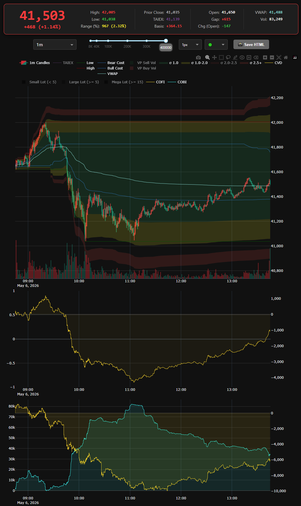

# Gale Quant Engine 微觀結構解讀秘笈 (Microstructure Playbook)

本指南專注於解析 Gale Quant Engine 中核心訂單流指標（CVD, COBI, COFI）的聯動關係，協助交易員從「累積絕對量」的宏觀視角，精準捕捉市場的提前轉折點。

---

## ▍核心三兵種定義

在解讀圖表前，請將這三個指標想像成戰場上的三個不同兵種：

1. **CVD (市價淨買賣量)** —— **衝鋒的步兵 (主動攻擊)**
   * **本質**：市場上主動「市價」成交的淨量。
   * **意義**：代表散戶與動能程式當下的「行動力」。CVD 向上代表大家正在主動買進（吃掉上方的賣單）。

2. **COBI (最佳五檔掛單淨差額)** —— **防禦工事 (被動防守)**
   * **本質**：`累積(五檔 Bid 總量 - 五檔 Ask 總量)`。
   * **意義**：代表大戶佈下的「靜態牆」。COBI 急升代表下方買單牆迅速增厚，COBI 暴跌代表上方賣單牆瘋狂堆疊。

3. **COFI (掛單流動量)** —— **後勤運補 (動態意圖)**
   * **本質**：掛單變動量（新增掛單或撤單）的累積。
   * **意義**：代表大戶正在「搬磚」還是「拆牆」。用來確認目前的掛單牆是真實的意圖，還是準備撤退的假動作。

---

## ▍頂部抓轉折：致命的誘多陷阱 (Liquidity Trap)

當價格在早盤瘋狂拉升、突破前高時，請密切觀察這組背離訊號。

### 🚨 訊號特徵 (鱷魚嘴巴背離)：
* **價格與 CVD**：同步強勢創高（散戶瘋狂追價）。
* **COFI (黃線)**：不但沒有跟上，反而**開盤後一路垂直向下暴跌**。
* **COBI (青藍線)**：維持低檔甚至開始破低（代表 Ask 賣單遠大於 Bid 買單）。

> **📉 實戰盤面圖解：**
> 

### 🧠 底層心理學：拉高出貨 (Passive Supplying)
價格的上漲是「假象」，掛單的壓力才是「真相」。大戶根本不削用市價砸盤，他們只是不斷在價格上方鋪設越來越厚的賣單牆 (Ask)。散戶的 CVD 買盤全數撞在主力佈下的海綿上。當散戶買盤耗盡的瞬間，價格將迎來毫無支撐的自由落體崩盤。

> **🎯 實戰行動**：看到 CVD 向上但 COFI/COBI 垂直向下，**絕對禁止追多，並準備在 CVD 漲勢放緩時進場放空。**

---

## ▍底部抓轉折：恐慌殺盤與大戶接刀 (Absorption)

當市場發生恐慌性拋售，價格像斷線風箏般下墜時，如何判斷哪裡才是真正的「鐵底」？

### 🚨 訊號特徵 (天量吸籌)：
* **價格與 CVD**：一路破底，CVD 呈現巨大的負值（多殺多，恐慌停損）。
* **COBI (青藍線)**：在價格崩盤的過程中，**旱地拔蔥式地狂噴（例如從 0 噴到 +80k）**。

### 🧠 底層心理學：被動承接 (Catching the Falling Knife)
散戶在恐慌拋售，但為什麼價格跌到某個地方就跌不下去了？因為有一股極端龐大的資金（大戶），在下方張開了巨大的「限價買單網 (Bid)」。COBI 的狂噴代表他們在恐慌中默默吸收了所有的市價賣單（CVD）。

> **🎯 實戰行動**：當 COBI 創下天量高峰後**開始平緩或微幅下降**，且 CVD 不再破低時，代表「空頭力竭，籌碼吸收完畢」。這就是**破底翻的最佳進場點（勝率極高）**。

---

## ▍趨勢確認與流動性真空

### 1. 完美的健康趨勢 (安全持倉)
* **特徵**：CVD、COBI、COFI 三條線**同向發散**。
* **解讀**：步兵在衝鋒，防禦工事同步往前推進，後勤也不斷運補。這是最強的多/空頭趨勢，順勢操作，不要輕易猜頭摸底。

### 2. 流動性真空與破底翻前兆
* **特徵**：在 V 型反轉的起點，COBI 往往會先攀上高峰，但在價格開始 V 轉向上時，**COBI 反而開始下降**。
* **解讀**：因為底部已經確立，大戶不需要再把資金掛在下面「防守」了。他們開始撤掉下方的被動買單（COBI 下降），轉而變成主動攻擊的市價單（CVD 回升）。這是一個「確認」趨勢反轉的二次訊號。

---

## 💡 總結心法：尋找「努力與結果」的背離

在 Gale Quant Engine 前，永遠問自己三個問題：
1. **方向是誰推的？** (看 CVD)
2. **前面有沒有牆？** (看 COBI)
3. **牆是真的還是假的？** (看 COFI)

當你發現市場付出了極大的努力（CVD 狂飆），卻撞上了越築越厚的牆（COBI 反向），這就是微觀結構送給你最好的交易禮物。
