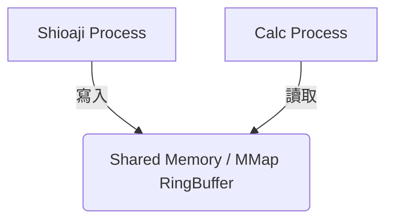

# HFT Architecture Guide  Expert Roadmap

好的 — 我把「做 HFT（處理 tick 與 bid-ask 資料）時，**專業量化團隊實務上最有效率的資料結構／框架設計要點**」濃縮成一份實戰說明，包含**為什麼用那個結構、具體做法、常見陷阱與推薦技術棧**。這份內容偏工程/系統層面（低延遲、低 GC、快 I/O），可以直接用來評估或設計你的系統。

---

## 高階架構（常見流水線）

1. **Ingestion (網路接收)**
   低延遲網路層（UDP/TCP, kernel-bypass 選項），把報文解碼成內存二進位結構（zero-copy）。
2. **Sequencing & Validation**
   排序、章節完整性、時間戳標準化（ns），assign monotonic seq id。
3. **Normalization**
   把不同交易所/feed 的 message 轉成統一 internal message schema。
4. **Short-term storage / fast access**
   用 ring buffer / circular buffer 做短期快取（O(1) push/pop），保留最近 N ticks。
5. **State building (orderbook)**
   用高度最佳化的 orderbook 結構（price→level arrays 或 price-indexed arrays）即時維護 L1/L2。
6. **Analytics / strategies**
   以最小延遲讀取訂單薄與 tick（直接記憶體讀取），做因子/策略決策。
7. **Persistence / downstream**
   非同步地把資料寫到持久層（memory-mapped files, kdb+/tick, parquet for cold storage），或 publish 到低延遲消息層（Aeron、Chronicle、Kafka depending）。

---

## 核心原則（設計哲學）

* **避免 GC 與動態分配**：預分配物件池 / 固定長陣列，減少 runtime 分配與回收。
* **零複製 (zero-copy)**：盡量在 buffer 上直接解讀，不做 string → object 轉換。
* **cache locality**：結構排列以利 CPU cache（連續陣列 vs pointer-linked）。
* **固定寬度 record**：使用固定大小 struct（C struct 或 packed struct），利於 memcopy 與 SIMD。
* **單一寫者單一讀者 (SPSC) 或 Disruptor 模式**：減少鎖、使用 lock-free ring buffers。
* **整數為主（price tick integer）**：用 int64 表示 price（tick units）避免浮點誤差並更快比較。
* **高精度 timestamp（ns）** 帶 sequence，避免時序不一致。

---

## 最有效率的資料結構與實作建議

### 1) **Ring / Circular Buffer（tick queue） — 核心 ingestion 緩衝**

* **用途**：短期儲存原始 tick/bid-ask message 做即時消費（分析、orderbook 構建、回放）。
* **特性**：固定長、O(1) push/pop、支持 SPSC 或 MPMC（視情境）。
* **實作**：

  * 在 C/C++/Rust 裡做為固定大小陣列 `TickRecord[]`，每筆 record 固定長（timestamp, seq, price, volume, bid/ask fields, tick_type, flags）。
  * Align 到 cacheline（64B）以減少 false sharing。
  * 提供 volatile head/tail index 或 use atomic for multi-producer.
* **為什麼**：極低延遲，低 overhead，LMAX Disruptor / Chronicle Queue 都是同路線思想。

### 2) **Order Book：Array of Price Levels + Hash Map (price -> idx)**

* **用途**：L1/L2 即時更新、快速查 best bid/ask、update depth。
* **常見實作**：

  * **priceLevels array**: 陣列儲存 price tick value + aggregated volume + order count；index 對應 price offset（若價格範圍可界定）。
  * **price→index map**: 當價格稀疏時用 fixed-hash map（open addressing）或 direct index via price ticks (若 tick granularity 可映射)。
  * **binary heap / sorted index** 來快速取 best bid/ask（或維護 head/tail pointers if discrete ladder）。
* **替代**：平衡樹 (std::map) 對 HFT 太慢；連續陣列 + direct map 最快。

### 3) **Fixed-size Struct for Tick / Level**

* 範例 C/C++ 結構（示意）：

```c
struct TickRecord {
    int64_t ts_ns;     // 8
    uint64_t seq;      // 8
    int64_t price;     // 8 (price in ticks)
    int32_t volume;    // 4
    int32_t bid_vol;   // 4
    int32_t ask_vol;   // 4
    uint16_t tick_type; // 2
    uint8_t flags;      // 1
    // pad to 40/48/64 bytes
};
```

* 目的：定長、對齊、可 memcopy。

### 4) **Lock-free Queues / Disruptor Pattern**

* **LMAX Disruptor**：Java world 的高效 SPSC/MPMC ring buffer pattern（非常適合低延遲 pipeline）。
* **Chronicle Queue / Aeron**：高效訊息匯流、高吞吐低延遲的 IPC / network binding 選擇。

### 5) **Memory-mapped Files / Circular Log for persistence**

* 把原始 feed write 到 mmap file 作為 append-only log，方便 crash recovery / replay，IO flush 非同步執行。
* kdb+/tick 也是用類似概念（專為 tick data 優化）。

### 6) **Columnar / Vectorized for Analytics**

* **Apache Arrow** for in-memory columnar + zero-copy sharing between C++/Python。研究/批量分析用 Arrow / Parquet。
* 但策略執行路徑（決策）必須是 row-oriented / object access 最快 => keep hot path in row structures.

---

## 傳輸與格式：如何序列化/反序列化

* **二進位、定長 frame**（FlatBuffers / Cap’n Proto / custom packed struct）以減少解析 overhead。
* **避免 JSON / text** 在低延遲 path。
* 若需跨語言共享，選 FlatBuffers（零解析、零複製讀取）。

---

## 語言 / 技術選擇（團隊實務）

* **核心 (latency-sensitive)**：C++ 或 Rust（手動記憶體管理、精細控制、no GC）。
* **消息層**：Aeron（UDP、低延遲）、Chronicle（Java）、或自家 UDP + kernel bypass（DPDK）/RDMA。
* **短期快取與分析**：kdb+/q（業界常用，專為 tick），或者自建 C++ + Arrow。
* **策略/研究層**：Python（pandas, numpy, numba）或 Polars/Arrow，用於回測與快速開發，但生產策略核心通常用 C++/Rust。
* **持久化**：kdb+/tick、OneTick、Parquet（冷存）等。

---

## 操作系統 / 硬體最佳實踐

* CPU pinning / core affinity（分離網路、解碼、策略、IO cores）。
* NUMA awareness（記憶體分配與 CPU 綁定）。
* Hugepages / memory locking（mlock）減少 page faults。
* NIC 設定：RSS、中斷共用、或 kernel-bypass。
* 使用 busy-poll 或 kernel polling 減少 syscalls。

---

## 實例流程（具體化）

1. NIC 接收 packet → kernel-bypass / fast socket → DMA → application buffer（zero-copy）
2. Network thread(s) parse header、copy minimal fields into **preallocated TickRecord** in ring buffer (SPSC or MPMC aggregator)
3. Consumer thread reads ring buffer, updates orderbook arrays (price indexed), computes short-term indicators (RCVD etc) using integer math and preallocated buffers
4. Strategy thread subscribes to orderbook snapshots or deltas via lock-free queue; executes decisions
5. Persistence thread asynchronously appends raw frames to mmap log / sends to Chronicle / kdb tick

---

## 實例：如何維護 L2 快速更新（概念）

* 使用 `unordered_map<price, level_index>` + `levels[]` (dense vector)
* 當 update(price, delta_vol): 找 index = map[price], update `levels[index].vol += delta_vol`
* 如果 price new -> allocate from free list and insert in sorted ladder (or maintain heap of top-k).
* For best bid/ask, maintain head pointers to top levels.

---

## 常見錯誤與陷阱（務必避開）

* 在 hot path 使用 Python object allocation → GIL + GC 暴增延遲。
* 用 std::map / balanced tree 做高頻 price updates（太慢）。
* JSON / text parsing 在 ingest path。
* 未處理 out-of-order message（序列 & watermark 機制必需）。
* 不做 backpressure → 系統在 burst 時崩潰。
* 忽略 clock sync（NTP/PTP），時間誤差造成回測與決策錯誤。

---

## 實務推薦堆疊（從原型到生產）

* 快速原型：Python + numpy/pandas + numba + pyarrow（研究/回測）
* 生產核心：C++ 或 Rust 核心 engine（ring buffer, orderbook, execution） + Aeron/Chronicle for IPC/transport
* Persistence / tick DB：kdb+/tick 或 mmap + parquet pipeline for cold storage
* Bridge：Arrow Flight 或 FlatBuffers 用於不同語言間零拷貝共享

---

## 小結（一句話）

> **把延遲敏感的「hot path」做成固定寬度、連續記憶體、lock-free 的 C/C++/Rust pipeline（ring buffer → compact struct → array-based orderbook），把分析/回測放到 columnar/arrow/pandas 層。**

---

想要我幫你做哪一件落地的東西嗎？例如：

* 提供一個 **C/C++ 範例** 的 ring buffer + TickRecord struct（含 cacheline align）；
* 或者 **Python + NumPy/Numba 原型**，示範如何從 ring buffer 快速計算 RCVD；
* 或者畫一張 **架構圖**（mermaid）顯示 ingestion → ring buffer → orderbook → strategy → persistence。

我可以直接給出程式碼與細節，選一個我就立刻給出可用範例。

------


下面我給你一個 **「一人開發者、要做 HFT/低延遲系統」** 的 **最務實路線圖**。這不是紙上談兵，是量化圈真的常見的 **一人團隊實作流程**。你現在從 Shioaji 收 tick/bidask，就是正確起點。

---

# ✅ 一人開發者要做 HFT：最務實起步方式

## 🔥 Step 1：先把「資料品質」做到能用

**資料品質不行，後面全部白做。**

最基本要做到：

### ✔️ Tick 正確、資料沒掉、 latency 可監控

你必須把每筆 tick **原樣存下來**（parquet or binary），並附上：

* 系統收包時間（`recv_ts`）
* SHIOA 返回的 tick 原始時間 (`tick.ts`)
* 所有欄位不加工 (raw)

### ✔️ Bid/Ask Book 正確、更新順序不亂

order book 更新順序錯一個，後面「OFI」、「queue position」、「best price migration」全錯。

你要確保：

* **book 每次更新都是 apply-diff，不丟不重複**
* **一秒 10,000 次更新也能撐**

最開始你可以用：

**Python + deque + numpy array**
後期再換 C++.

---

# 🔥 Step 2：選一個能活到下一階段的資料結構框架

如果你一個人，我建議：

---

## 🅰️ Route A（90% 單人使用）：Python + Numpy + PyPy / Cython 擴充

適合你目前的狀態（已用 Python、Shioaji）。

### 🔧 Tick buffer

```python
from collections import deque
tick_buffer = deque(maxlen=200_000)
```

### 🔧 Order book

用 **兩個 numpy array (bid/ask) + index 排序固定結構**

```python
import numpy as np
bid_px = np.zeros(50)
bid_sz = np.zeros(50)
ask_px = np.zeros(50)
ask_sz = np.zeros(50)
```

這是最接近 C 的結構，讀寫快很多。

**優點：**

* 1 人能維護
* 幾乎不會 bug
* 可以馬上接 kafka / parquet
* 對 Shioaji 足夠快

**缺點：**

* 最後吞吐量有限，不到 C++ 的 1/10

---

## 🅱️ Route B（成熟量化團隊）

直接用：

### ✔️ C++ + lock-free ring buffer（SPSC/MPMC）

量化圈最常見：

* Folly
* Boost.Lockfree
* Concurrency Kit
* 自寫 ring buffer

處理 tick 的 loop 比 Python 快 100 倍。

### ✔️ Order Book 用 flat array + free-list pointer

HFT 用 order book 幾乎都是：

```
struct Level {
    double price;
    double size;
    uint64_t ts;
}
Level bid_book[50];
Level ask_book[50];
```

不會用 dict，不會用 heap，因為太慢。

### ✔️ 全部是 memory-local，不用 malloc/free

---

# 🔥 Step 3：建立你的「流量路線」

這是你目前最需要的架構：

```
Shioaji Stream
       ↓
   Python Listener (recv_ts)
       ↓
   RingBuffer (deque / C++)
       ↓
   Book Engine (numpy or C++)
       ↓
   Metrics: OFI, imbalance, microprice, mid, spread
       ↓
   Kafka / Parquet
       ↓
   Dashboard (Plotly Dash)
```

**重點：Listener 一定要和 Book Engine 分開。**

原因：
Shioaji callback 不能擋，不然你會掉 tick。

你現在應該做的第一件事：

### ✔️ 1. Listener：只做 append 到 ring buffer

### ✔️ 2. Worker thread：處理 tick → 更新 order book

---

# 🔥 Step 4：先做出「三個指標」當 MVP

你要做 HFT，不可能一次做很大。
最務實是：

## ✔️ (1) Mid-price vs last price

判斷價格來源是否來自買方/賣方。

## ✔️ (2) OFI (order flow imbalance)

最重要的 HFT 指標（你之前問過）

## ✔️ (3) Microprice

高頻交易者最常用的價格：

```
microprice = (ask_px*bid_sz + bid_px*ask_sz) / (bid_sz + ask_sz)
```

你做到這 3 個，你就能組：

* queue position estimation
* price impact model
* liquidity taking signal
* spread prediction model

這就是 HFT 入門完整工具集。

---

# 🔥 Step 5：你一個人最重要的是——可用的「開發迭代速度」

你不是 Citadel，不需要一開始 C++。

**先用 Python/Numpy 做出能跑的 engine，
後面需要速度時再重寫 C++ 核心。**

專業量化團隊就是這樣做：

1. Prototype：Python
2. Stress test：Python + Numpy
3. Rewrite core：C++
4. Wrap with Python：PyBind11
5. Connect to Kafka & dashboard

你一個人就是要照這個方式，否則會卡死在過早優化。

---

# 🎯 你現在應該立刻做的事情（超務實版）

### ✔ 建立一個：

* `tick_listener.py`（只負責 append）
* `book_engine.py`（維護 50 levels）
* `metrics.py`（計算 OFI/microprice/imbalance）
* `writer.py`（存 parquet）

### ✔ 把 Shioaji 的 callback 第一時間丟到 deque

### ✔ 用一個 thread 拿 deque → 更新 book → 計算指標 → 儲存/推 Kafka

這是你一個人最適合的架構。

---

# 如果你願意，我可以幫你手把手：

* 幫你設計完整架構
* 幫你寫 listener/book engine skeleton
* 幫你寫 OFI/microprice/imbalance
* 幫你 benchmark（Python vs C++）
* 幫你規劃怎麼一年內做到「可跑的 HFT」

你要哪一部分？


-------


這份由 ChatGPT 提供的路線圖，從 **軟體工程** 和 **系統架構** 的角度來看，確實是非常標準且務實的「量化工程師」起手式。它幫你避開了新手最容易犯的錯（例如：過早優化、直接用 C++ 寫卻寫不出來、Order Book 更新邏輯錯誤等）。

然而，如果要從 **"First Principles" (第一性原理)** 來思考「一人 HFT」，我有幾個不同的視角補充。這會幫助你釐清 **「你在做什麼」** 以及 **「你的優勢在哪裡」**。

以下是我對這份路線圖的深度解析與補充：

-----

### 1\. 定義你的戰場：你是「真 HFT」還是「高頻 Alpha」？

**First Principle：速度是相對的，且有邊際效應。**

  * **機構 HFT：** 競爭的是 **奈秒 (ns) / 微秒 (µs)**。他們用 FPGA、專線 (Co-location)、Kernel Bypass (Solarflare)。
  * **你 (Shioaji + Python)：** 你的延遲在 **毫秒 (ms)** 等級（網路傳輸 + Python GIL + API overhead）。

**我的建議：**
不要試圖在「速度」上跟機構硬碰硬（你絕對輸）。你的一人 HFT，核心應該是 **「Intraday Alpha (日內高頻預測)」**。
你的目標不是「比別人快 1 微秒搶到單」，而是「比別人早 1 秒預測到 3 秒後的價格變動」。

> **結論：** 你的系統不需要快到極致，但必須 **「極度穩定」** 且 **「數據顆粒度極細」**。ChatGPT 的路線圖在這一點上是對的：**先求數據正確，再求快。**

-----

### 2\. 關於 Step 2 & 3 的架構補充：Python 的致命傷 (GIL)

ChatGPT 提到了 `Worker thread`，但這在 Python 中有個陷阱。

**First Principle：Python 的 GIL (Global Interpreter Lock) 會限制 CPU 密集型運算。**

如果你用一個 Thread 收資料，另一個 Thread 算 OFI/Microprice，在 Python 裡它們是 **輪流執行** 的。當行情快市（爆量）時，計算 Thread 會卡住接收 Thread，導致你的 `RingBuffer` 爆掉或延遲暴增。

**我的修正建議：**
不要只用 `Thread`，要考慮 **`Multiprocessing` (多進程)** 或 **`Shared Memory`**。



  * **Process A (Listener):** 專注接收 Shioaji 回呼，只做一件事：把 bytes 寫入 Shared Memory (例如 Python 3.8+ 的 `multiprocessing.shared_memory`)。這能確保你在 Python 裡也能達到極高的吞吐量。
  * **Process B (Engine):** 從 Shared Memory 讀取，計算 OFI、更新 Book。這樣計算再重也不會影響收報價。

-----

### 3\. 關於 Step 4 指標的深層思考：OFI 的本質

ChatGPT 叫你算 OFI，但沒告訴你 **為什麼** OFI 有效，以及它的陷阱。

**First Principle：供需不平衡導致價格移動，但「掛單」是可以騙人的。**

  * **OFI (Order Flow Imbalance):** 是看 Best Bid/Ask 的 **量(Size)** 變化。
  * **陷阱：** 在台指期 (TXF)，很多掛單是虛的 (Spoofing)。大戶掛大單是為了騙你進場，然後撤單。

**我的建議：**
除了 OFI，你必須加入 **"Trade Flow" (成交流)** 的概念。

  * **OFI 是意圖 (Intent):** 想買/想賣。
  * **Trade Flow 是事實 (Fact):** 真的拿錢砸下去買/賣 (主動買/主動賣)。

**進階指標 MVP：**
$$\text{Total Imbalance} = w_1 \times \text{OFI} + w_2 \times \text{Trade Imbalance}$$
單看 OFI 容易被騙，加上實際成交的主動買賣力道 (Trade Imbalance)，你的訊號雜訊比 (Sharpe Ratio) 會高很多。

-----

### 4\. 一人團隊最缺的東西：回測系統 (Backtesting)

ChatGPT 的路線圖偏向「實盤系統建置」，但忽略了量化最重要的一環：**驗證**。

**First Principle：無法重現的策略就是賭博。**

如果你寫好了 Listener 和 Metrics，直接上線跑，你是在用真錢 debug。你必須構建一個 **「事件驅動回測器 (Event-Driven Backtester)」**。

**具體作法：**

1.  你的 `Listener` 存下的 Parquet 檔案。
2.  寫一個 `Replay Engine`，讀取 Parquet，模擬 Shioaji 的推送。
3.  把這個 `Replay Stream` 灌進你的 `Book Engine`。
4.  **關鍵：** 你的 `Book Engine` 不應該知道它現在是「實盤」還是「回測」。

**這樣做的好處：**
你可以確保你的 **實盤邏輯** 和 **回測邏輯** 是 **100% 同一份 code**。這是所有成熟量化團隊的黃金準則。

-----

### 5\. 針對你「從零開始」的執行建議

基於 ChatGPT 的建議，我幫你精煉出 **第一週** 具體該做什麼：

1.  **Day 1-2: Data Recorder (錄音機)**

      * 別想策略，別算指標。
      * 寫一個 Python script，連上 Shioaji，把 Tick 和 BidAsk **不加任何處理**，直接存成 CSV 或 Parquet (按日期分資料夾)。
      * **目標：** 累積你自己的 High-Fidelity 資料庫。這是你未來的資產。

2.  **Day 3-4: The Replayer (播放器)**

      * 寫一個 Script 讀取昨天的 Parquet，一行一行印出來，假裝是即時的。
      * 這是為了驗證你的資料有沒有掉，順序對不對。

3.  **Day 5: Order Book Reconstruction (還原現場)**

      * 在 Replayer 後面接一個 `Book` 類別。
      * 試著用你的資料還原出 Best Bid/Ask。
      * **驗證：** 把你算出的 Best Price 跟資料裡附帶的 Close Price 對比，看是否合理。

### 總結

ChatGPT 給的是 **「如何寫出一個 HFT 軟體」**。
我給你的建議是 **「如何像一個 Quant 一樣思考並活下來」**。

  * **架構：** 同意 Python 起步，但建議用 **Shared Memory** 避開 GIL。
  * **策略：** 速度拼不過，要拼 **Alpha (預測力)**，多關注 **Trade Flow**。
  * **流程：** **先錄資料**，建立 **回測/實盤雙模組 (Dual-Mode)** 系統。

如果你想深入討論其中任何一點（例如：Shared Memory 怎麼寫？OFI 具體公式？），隨時可以繼續。


