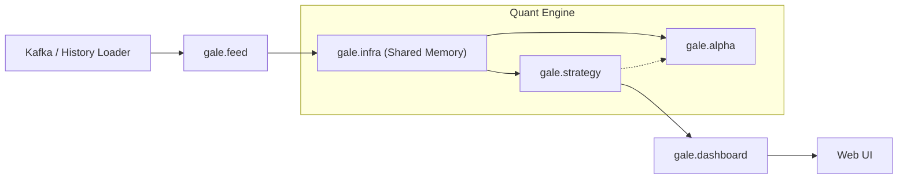

# 🇹🇼 TXF Gale Quant Engine (v1.0)

**TXF Gale Quant Engine** 是一個專為台灣指數期貨 (TXF) 設計的超低延遲量化數據管線與實時監控系統。

本版本 (V1.0) 專注於 **Tick 成交數據** 的極速處理與視覺化，採用 **Gale Modular Architecture** 與 **RingBuffer + Numba** 技術，實現了 $O(1)$ 複雜度的實時指標運算，並透過 Dash 提供毫秒級的戰情室監控。

---

## 🌟 核心功能 (Key Features)

### ⚡️ 極限效能 (Performance)
* **RingBuffer 架構**：使用預先分配記憶體的 NumPy 陣列 (Shared Memory)，實現零動態分配 (Zero-allocation) 的數據寫入。
* **Numba JIT 加速**：指標運算邏輯編譯為機器碼，計算速度接近 C/C++。
* **O(1) 演算法**：利用累積和 (Prefix Sum) 技術，無論計算 5 分鐘還是 5 小時的 VWAP，耗時皆相同且極低。
* **Smart Downsampling**：前端繪圖採用智慧降頻與二分搜尋 (Bisect)，即使回溯 5 萬筆數據，CPU 佔用率仍低於 5%。

### 📊 專業視覺化 (Professional Visualization)
* **暗黑戰情室 UI**：針對長時間看盤設計的低對比度深色主題。
* **多週期 K 線切換**：支援 5s, 1m, 5m, 15m 等多種週期的 K 線即時聚合與切換。
* **雙向同步縮放**：主圖 (價格) 與副圖 (動能) 的 X 軸縮放與平移完美同步。
* **即時戰情看板**：即時顯示當盤高低、波幅、開盤漲跌、VWAP 乖離率及基差。

### 🔄 雙模運作 (Dual Mode)
* **Live Mode**：連接 Kafka 進行實時串流監控。
* **History Mode**：指定日期進行歷史數據全速回放 (Backtest Replay)，用於策略驗證與除錯。

---

## 🏗️ 系統架構 (Architecture)

本系統採用 **Gale Modular Architecture**，職責分明：

*   **`gale.infra`** (Infrastructure): 底層記憶體管理 (Shared Memory)。
*   **`gale.feed`** (Feed Layer): 數據攝取與轉換 (Kafka Consumer, Ingest Server)。
*   **`gale.alpha`** (Alpha Layer): 純粹的數學運算與訊號生成 (Numba Engine, Volume Profile)。
*   **`gale.strategy`** (Execution Layer): 策略邏輯與執行引擎。
*   **`gale.dashboard`** (UI Layer): 視覺化戰情室 (Dash Server)。



-----

## 🛠️ 安裝與設定 (Setup)

### 1. 環境需求

  * Python 3.10+
  * Kafka Server

### 2. 安裝依賴

```bash
pip install -r requirements.txt
```

*(核心依賴: `confluent-kafka`, `numpy`, `numba`, `dash`, `plotly`, `pandas`, `uvloop`)*

### 3. 配置設定

修改 `config/` 下的設定檔：
*   `settings.py`: 全域參數。
*   `indicator_config.py`: 指標參數 (如 SMA 週期)。

-----

## 🚀 如何執行 (Usage)

V1.0 版本統一使用 `bin.start_engine` 作為入口：

### 1. 實時監控模式 (Live Mode)

預設連接 Kafka 並開始接收即時 Tick。

```bash
python -m bin.start_engine
```

### 2. 歷史回測模式 (History Mode)

指定日期，全速回放當天數據以驗證邏輯。

```bash
python -m bin.start_engine --mode history --date 2025-12-09 --session day
```

*加上 `--session night` 可回測夜盤。*

-----

## 📂 專案結構 (Project Structure)

```text
txf-gale-engine/
├── bin/                # 🚀 執行入口 (Launchers)
│   ├── start_engine.py      # 主程式入口
│   └── start_dashboard.py   # Dashboard 獨立進程
├── gale/               # 📦 核心套件
│   ├── infra/          # 基礎設施 (Memory)
│   ├── feed/           # 數據源 (Kafka)
│   ├── alpha/          # 訊號核心 (Numba)
│   ├── strategy/       # 策略執行
│   └── dashboard/      # 視覺化介面
├── config/             # ⚙️ 系統配置
├── data_schemas/       # 📝 Protobuf 定義
├── Notes/              # 📚 開發筆記
└── tools/              # 🔧 實用工具
```

-----

## ⚠️ Disclaimer

本系統僅供量化研究與技術分析使用，不構成任何投資建議。高頻交易涉及高風險，請謹慎使用。

-----