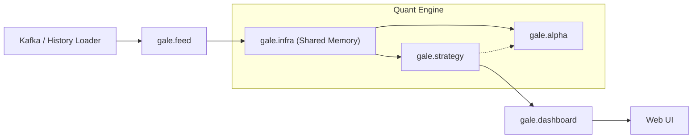

# 🇹🇼 TXF Gale Quant Engine (V2.0)

**TXF Gale Quant Engine** 是一個專為台灣指數期貨 (TXF) 設計的超低延遲量化數據管線與實時監控系統。

本版本 (V2.0) 專注於 **Tick 成交數據** 的極速處理與視覺化，採用 **Gale Modular Architecture** 與 **RingBuffer + Numba** 技術，實現了 $O(1)$ 複雜度的實時指標運算，並透過 Dash 提供毫秒級的戰情室監控。

---

## 🌟 核心功能 (Key Features)

### ⚡️ 極限效能 (Performance)
* **RingBuffer 架構**：使用預先分配記憶體的 NumPy 陣列 (Shared Memory)，實現零動態分配 (Zero-allocation) 的數據寫入。
* **Numba JIT 加速**：指標運算邏輯編譯為機器碼，計算速度接近 C/C++。
* **O(1) Smart Slicing**：後端實現智慧切片視圖 (Vectorized View)，無論回溯 100K 筆還是 1M 筆數據，記憶體傳輸量恆定為 ~2000 筆 (16KB)。
* **Smart Downsampling**：前端繪圖採用二分搜尋 (Bisect) 與降頻，CPU 佔用率極低。

### 📊 專業視覺化 (Professional Visualization)
* **暗黑戰情室 UI**：針對長時間看盤設計的低對比度深色主題。
* **多週期 K 線切換**：支援 5s, 1m, 5m, 15m 等多種週期的 K 線即時聚合與切換。
* **雙向同步縮放**：主圖 (價格) 與副圖 (動能) 的 X 軸縮放與平移完美同步。
* **即時戰情看板**：即時顯示當盤高低、波幅、開盤漲跌、VWAP 乖離率及基差。

### 🔄 雙模運作 (Dual Mode)
* **Live Mode**：連接 Kafka 進行實時串流監控。
* **History Mode**：指定日期進行歷史數據全速回放 (Backtest Replay)，用於策略驗證與除錯。

---

## 🏗️ 系統架構 (Architecture)

本系統採用 **Gale Modular Architecture**，職責分明：

*   **`gale.infra`** (Infrastructure): 底層記憶體管理 (Shared Memory)。
*   **`gale.feed`** (Feed Layer): 數據攝取與轉換 (Kafka Consumer, Ingest Server)。
*   **`gale.alpha`** (Alpha Layer): 純粹的數學運算與訊號生成 (Numba Engine, Volume Profile)。
*   **`gale.strategy`** (Execution Layer): 策略邏輯與執行引擎。
*   **`gale.dashboard`** (UI Layer): 視覺化戰情室 (Dash Server)。



-----

## 🛠️ 安裝與設定 (Setup)

### 1. 環境需求

  * Python 3.10+
  * Kafka Server

### 2. 安裝依賴

```bash
pip install -r requirements.txt
```

*(核心依賴: `confluent-kafka`, `numpy`, `numba`, `dash`, `plotly`, `pandas`, `uvloop`)*

### 3. 配置設定

修改 `config/` 下的設定檔：
*   `settings.py`: 全域參數。
*   `indicator_config.py`: 指標參數 (如 SMA 週期)。

-----

## 🚀 如何執行 (Usage)

V1.0 版本統一使用 `bin.run_supervisor` 作為入口：

### 1. 實時監控模式 (Live Mode)

預設連接 Kafka 並開始接收即時 Tick。

```bash
python -m bin.run_supervisor
```

### 2. Kafka 歷史回放模式 (History Mode)

指定日期進行歷史數據回放。

```bash
python -m bin.run_supervisor --mode history --date 2025-12-24 --session night
```

### 3. Parquet 歷史回放與分析模式 (History & Analysis) -> [New!]
 
 V1.1 新增了基於 Parquet 檔案的高效回放引擎，支援多日連續回放與靜態全歷史分析。
 
 #### (A) 即時模擬回測 (Realtime Simulation)
 
 模擬真實盤中時間流逝，用於觀察策略與指標的動態變化。
 
 ```bash
 # 播放單日 (預設速度 1.0x)
 python bin/run_supervisor.py --source parquet --date 2025-12-08
 
 # 播放多日連續行情 (e.g. 12/08 ~ 12/11)
 python bin/run_supervisor.py --source parquet --date 2025-12-08 --end-date 2025-12-11
 ```
 
 #### (B) 極速全歷史分析 (Instant Load / Static Analysis)
 
 忽略時間間隔，以極限速度 (Speed=0) 將指定日期範圍的所有資料一次性載入記憶體。
 適用於進行這幾天的 K 線全貌分析、Volume Profile 分佈研究，或快速驗證指標邏輯。
 
 ```bash
 # 加上 --speed 0 啟用極速模式 (數十萬筆資料秒開)
 python bin/run_supervisor.py --source parquet --date 2025-12-08 --end-date 2025-12-11 --speed 0
 ```
 
 > **💡 Smart CLI Behavior:**
 > *   若直接輸入 `--date`，系統自動判斷為 **Parquet Source**。
 > *   若需跑 Kafka 的歷史模式，請明確指定 `--mode history`。
 
 > **💡 New Features:**
 > *   **Smart Resolution**: 系統會自動根據日期尋找 TXF (期貨) 與 TSE (加權指數) 的 Parquet 檔案。
 > *   **Dynamic Capacity**: Shared Memory 會根據載入天數自動擴容 (e.g. 4 天 -> 80 萬筆容量)，確保資料不遺失。
 > *   **Session Awareness**: 指標 (VWAP, High/Low) 會在每日及夜盤開盤時自動重置。
  
  *(Legacy Kafka History Mode 仍保留，透過 `--mode history` 呼叫)*

-----

## ⚙️ 參數說明 (Arguments Reference)

| Argument | Value | Description |
| :--- | :--- | :--- |
| **`--source`** | `kafka` (**Default**) | **實時模式 (Live Mode)**。連接 Kafka 接收交易所即時行情。 |
| | `parquet` | **回放模式 (Replay Mode)**。讀取 Parquet 檔案進行回測或分析。 |
| **`--speed`** | `0` (**Default**) | **極速載入 (Instant)**。自動全速載入資料 (Static Analysis)。 |
| | `1.0` | **即時模擬 (Realtime)**。依據歷史時間間隔播放，模擬盤中節奏。 |
| | `> 1.0` | **倍速播放 (Fast Forward)**。例如 `5.0` 代表 5 倍速快轉。 |
| `--date` | `YYYY-MM-DD` | 指定回放起始日期 (Parquet Mode 必填)。 |
| `--end-date` | `YYYY-MM-DD` | 指定回放結束日期 (選填，若無則只回放單日)。 |
| **`--mode`** | `live` (**Default**) | **實時監控**。正常盤中運作模式 (Kafka Live)。 |
| | `history` | **歷史回測**。用於 Legacy Kafka 回放 (需明確指定)。 |
| **`--session`** | `day` (**Default**) | **指定盤別**。用於 Kafka History Mode。 |
| | `night` | 指定夜盤時段 (前日 15:00 ~ 當日 05:00)。 |

-----

## 📂 專案結構 (Project Structure)

```text
txf-gale-engine/
├── bin/                # 🚀 執行入口 (Launchers)
│   ├── run_supervisor.py      # 主程式入口 (統一啟動 Ingest/Strategy/Dash)
│   └── run_dashboard.py       # Dashboard 獨立進程 (由 Supervisor 呼叫)
├── gale/               # 📦 核心套件
│   ├── infra/          # 基礎設施 (Memory)
│   ├── feed/           # 數據源 (Kafka)
│   ├── alpha/          # 訊號核心 (Numba)
│   ├── strategy/       # 策略執行
│   └── dashboard/      # 視覺化介面
├── config/             # ⚙️ 系統配置
├── data_schemas/       # 📝 Protobuf 定義
├── Notes/              # 📚 開發筆記
└── tools/              # 🔧 實用工具
```

-----

## ⚠️ Disclaimer

本系統僅供量化研究與技術分析使用，不構成任何投資建議。高頻交易涉及高風險，請謹慎使用。

-----