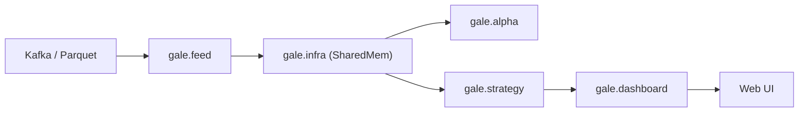

# 🇹🇼 TXF-DayTradeDash (V2.0)

台灣指數期貨 (TXF) 的低延遲量化數據管線與實時看盤系統。專注 **Tick 成交數據** 的極速處理與視覺化：以 **RingBuffer + Numba** 實現 $O(1)$ 實時指標運算，透過 Dash 提供毫秒級戰情室。

---

## 🌟 核心功能

**效能**
* **RingBuffer + Shared Memory**：預先配置的 NumPy 陣列，零動態分配寫入。
* **Numba JIT**：指標運算編譯為機器碼。
* **O(1) Smart Slicing**：無論回溯 100K 或 1M 筆，記憶體傳輸恆定 ~2000 筆 (16KB)。

**視覺化**
* **暗黑戰情室 UI**、**多週期 K 線** (5s/1m/5m/15m)、**主副圖同步縮放**。
* **即時戰情看板**：當盤高低、波幅、開盤漲跌、VWAP 乖離、基差。
* **全日盤連續圖**：夜+日同框，自動收合盤間空檔與週末 (`rangebreaks`)、換盤處分隔線；VWAP 標準差色帶 (Semi-Z) 依盤別獨立計算,不跨盤填色。

**雙模運作**
* **Live**：連 Kafka 實時串流。**History**：指定日期全速回放 (Kafka 或 Parquet)。

---

## 🏗️ 架構

模組化分層，職責分明：

| 模組 | 職責 |
| :--- | :--- |
| `gale.infra` | 底層記憶體管理 (Shared Memory) |
| `gale.feed` | 數據攝取與轉換 (Kafka / Parquet Replay) |
| `gale.alpha` | 數學運算與訊號生成 (Numba, Volume Profile) |
| `gale.strategy` | 策略邏輯與執行 |
| `gale.dashboard` | 視覺化戰情室 (Dash) |



**效能解耦要點**
* **後端全速**：`gale.feed` 不受 UI 影響，極速寫入 `SharedRingBuffer`（行情抵達後 ~8μs 完成計算）。
* **前端抽樣**：UI 固定 **2 秒** 重繪一次（獨立定時器讀最新快照），避免高頻全量重繪的 Render Storm。
* **SVG 繪圖**：降頻至 ~2000 點後用 `go.Scatter` (SVG) 即無壓力。折線刻意**不用 `Scattergl` (WebGL)**——WebGL 不支援 `rangebreaks`（收合盤間空檔所必需），啟用會使 WebGL 折線整條消失。

---

## 🛠️ 安裝

```bash
uv venv
. .venv/Scripts/activate   # win  (mac: . .venv/bin/activate)
uv pip install -r requirements.txt
```

設定檔在 `config/`：`settings.py`（全域）、`indicator_config.py`（指標參數）。

---

## 🚀 執行

統一入口 `bin.run_supervisor`。

```bash
# Live 實時監控 (預設連 Kafka)
python -m bin.run_supervisor

# Kafka 歷史回放
python -m bin.run_supervisor --mode history --date 2026-01-16 --session day

# Parquet 回放：直接給 --date 即自動切 Parquet 來源
python bin/run_supervisor.py --source parquet --date 2025-12-08 --end-date 2025-12-11 --speed 0
```

`--speed 0` = 極速載入（數十萬筆秒開，靜態分析用）；`1.0` = 依歷史節奏即時模擬；`>1.0` = 倍速。
指標 (VWAP, High/Low) 會在每日及夜盤開盤自動重置，Shared Memory 依載入天數自動擴容。

### 批次匯出 HTML (`tools/batch_export_html.py`)

無需開網頁，全速產出含全指標 (COFI/COBI…) 的互動式 HTML 快照。

```bash
# Kafka 回放，預設日夜各自出檔
python tools/batch_export_html.py --start-date 2026-04-01 --end-date 2026-05-01

# Parquet：未指定 --session 時預設「全日盤 (full)」，夜+日同框、自動跳過週六日
python tools/batch_export_html.py --start-date 2025-12-01 --end-date 2026-07-01 --source parquet

# 單抓某盤 (e.g. 週五夜盤其交易日試算在週六，故傳週六)
python tools/batch_export_html.py --start-date 2025-12-06 --session night --source parquet
```

* **來源預設**：`kafka` → `both`（日夜各自出檔）；`parquet` → `full`（全日盤）。
* **full 自動跳週末**：週一 parquet 檔已含上週五夜盤，工作日即完整涵蓋；`night/day/both` 不跳。
* 假日/缺檔自動略過（印 warning 不中斷）。存至 `snapshots/`，檔名帶盤別後綴：`FD`=全日 / `0N`=夜 / `0D`=日，`_p`=parquet（如 `TXF-Chart-2025-12-01-FD_p.html`）。

### 批次匯出五檔 (`tools/batch_export_bidask.py`)

透過 Kafka 將指定範圍五檔 (BidAsk) 匯出為 Parquet，支援斷點續傳、自動略過非交易日。

```bash
python tools/batch_export_bidask.py --start-date 2025-12-01 --end-date 2026-05-10 --session both
```

直接解析 Protobuf 還原原始五檔陣列，依年月存至 `D:\txf-data\raw_ticks\TXF\`（如 `2026-05-09_TXF_bidask.parquet`）。

---

## ⚙️ 參數速查

| 參數 | 值 | 說明 |
| :--- | :--- | :--- |
| `--source` | `kafka` (預設) / `parquet` | 資料來源。給 `--date` 未指定時自動切 Parquet。 |
| `--speed` | `0` (Parquet 預設) / `1.0` / `>1.0` | 極速載入 / 即時模擬 / 倍速。僅 Parquet 有效。 |
| `--date` / `--end-date` | `YYYY-MM-DD` | 回放起訖日（Parquet 必填起始）。 |
| `--mode` | `live` (預設) / `history` | 實時 / Kafka 歷史回放。 |
| `--session` | `day` / `night` / `full` / `both` | 日盤 / 夜盤 / 全日盤(夜+日同框) / 日夜各自出檔(僅 batch_export)。 |

---

## 📂 專案結構

```text
txf-daytradedash/
├── bin/                # 執行入口 (run_supervisor / run_dashboard)
├── gale/               # 核心套件 (infra / feed / alpha / strategy / dashboard)
├── config/             # 系統配置
├── tools/              # batch_export_html.py / batch_export_bidask.py
├── snapshots/          # 匯出的 HTML 圖表快照
├── data_schemas/       # Protobuf 定義
└── README.md
```

---

## ⚠️ Disclaimer

僅供量化研究與技術分析，不構成投資建議。高頻交易高風險，請謹慎使用。
