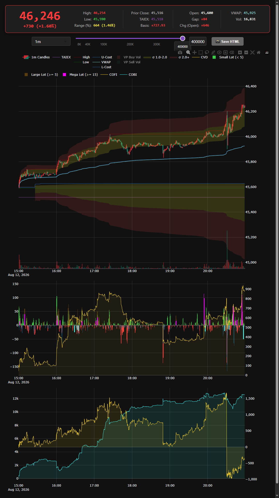

# txf-gale-engine(repo: TXF-DayTradeDash)— 台指期當沖戰情室


*Live 戰情室看板(1m,2026-08-12 夜盤 · `7449902`)—— 計分板、σ 色帶 / U-L Cost / VWAP 主圖、CVD·COFI·COBI 與逐筆分級量*

低延遲 tick 管線 + Dash 即時看板。以 **RingBuffer + Shared Memory + Numba** 做 O(1) 即時指標運算,
UI 每 2 秒刷新。另有**四支 headless 批次工具**(HTML 快照 / 五檔 BidAsk / 跨月價差事件 / Quote 原始流),
它們是 workspace 每日 sync 管線的一部分,見 [第 3 節](#3-批次匯出工具)。

```
永豐 Shioaji API
   ├─（即時）→ txf-streaming-server ─Protobuf→ Kafka ─┬─→ 【本專案】戰情室看板
   │                                                 └─→ txf-quant-platform（看盤/回測）
   └─（歷史）→ txf-data-lake ──Polars──→ Parquet ──────→ 兩者皆可讀
                                     (D:\txf-data)
```

> 📌 **本專案可獨立部署**,不需要其他 repo。作者日常看盤已移往另一套 viewer,
> 但本 repo 的**批次匯出工具仍在每日生產鏈上、持續維護**(見第 3 節)。

**兩種資料來源**:`kafka`(即時或歷史回放)與 `parquet`(離線回放)。
**沒有 Kafka 也能跑** —— 用 `--source parquet` 就只需要 Parquet 資料湖。

---

## 1. 安裝

需要 **Python 3.13** 與 [`uv`](https://docs.astral.sh/uv/)。

```bash
git clone <repo-url> && cd txf-gale-engine
uv venv
uv pip install -r requirements.txt
```

> 🔴 **升級套件一律用 `uv pip install --upgrade -r requirements.txt`**,別單獨升 polars 或 numpy:
> - `polars` 必須帶 `[rtcompat]` extra —— 少了它在**沒有 AVX2 的 CPU** 上會 **Illegal instruction 崩潰**。
> - `numpy` 釘在 2.4.6,上限來自 **numba**(`gale/alpha/` 實際使用 `@njit`,不可移除)。

### 需要設定的地方

| 設定 | 位置 | 說明 |
|---|---|---|
| `DATA_ROOT` | `config/settings.py` | Parquet 資料湖(預設 `D:/txf-data`) |
| `SNAPSHOT_ROOT` | `config/settings.py` | HTML 快照輸出(預設 `D:/txf-snapshot`) |
| Kafka broker | 環境變數 `GALE_KAFKA_BROKER` 或 CLI `--broker` | **預設 `localhost:9092`**。broker 在別台就設環境變數(一次設好,所有工具通用)或逐次帶 `--broker <ip>:9092`。⚠️ **別把位址寫回程式碼** —— 那會讓相依藏在預設值裡 |
| 指標參數 / 配色 | `config/indicator_config.py` / `config/ui_theme.py` | 走 config,不要寫死在程式裡 |

> ⚠️ **cwd 必須是 repo 根**(`.bat` 啟動器會硬檢查)。
> Windows 上所有 Python 指令前綴 `PYTHONUTF8=1`(`bin/*.py` 沒有自我 reconfigure stdout)。

---

## 2. 執行

統一入口 `bin.run_supervisor`(它會開兩個子行程:攝取寫 SHM、Dash UI 讀 SHM)。

```bash
# Live 即時監控(連 Kafka)                          → Dashboard http://127.0.0.1:8050
python -m bin.run_supervisor --broker <broker_ip>:9092
#   broker 在本機就不必帶(預設 localhost:9092);固定在別台則:
#   set GALE_KAFKA_BROKER=<ip>:9092    (Windows)   /   export …（bash）

# Parquet 離線回放(不需要 Kafka,最安全)            → Dashboard http://127.0.0.1:8051
python -m bin.run_supervisor --source parquet --date 2025-12-08 --speed 0

# Kafka 歷史回放
python -m bin.run_supervisor --mode history --date 2026-01-16 --session day
```

`--speed`:`0` = 極速載入(數十萬筆秒開,靜態分析用)、`1.0` = 依歷史節奏模擬、`>1.0` = 倍速。

> 🛑 **怎麼停**:supervisor **刻意無視 SIGTERM**,用 **Ctrl+C**,或在 repo 根建立 `.restart_signal` 檔。
> ⚠️ 殘留的 `.restart_signal` 會讓下次啟動立刻自殺 —— 停不下來或一啟動就死,先檢查這個檔。

### 參數速查

| 參數 | 值 | 說明 |
| :--- | :--- | :--- |
| `--source` | `kafka`(預設)/ `parquet` | 資料來源 |
| `--broker` | `ip:9092` | Kafka 位址,**換機器必給** |
| `--mode` | `live`(預設)/ `history` | 即時 / Kafka 歷史回放 |
| `--date` / `--end-date` | `YYYY-MM-DD` | 回放起訖(Parquet 必填起始) |
| `--speed` | `0` / `1.0` / `>1.0` | 僅 Parquet 有效 |
| `--session` | **各工具不同,見下** | |

> ⚠️ **`--session` 的合法值每個工具不一樣**:`run_supervisor` 只收 `day`/`night`;
> `gale.feed.ingest`/`replay` 收 `day`/`night`/`full`;`batch_export_html` 收
> `day`/`night`/`both`/`full`。有疑義以各腳本的 argparse 為準。

---

## 3. 批次匯出工具

> 📌 **這一節有四支工具,全部在生產鏈上** —— 是 workspace 每日 sync 九步裡的
> ④⑤⑦⑧,不是選配的玩具。四支都由 workspace 根的 `daily_sync.py` 每個工作日 13:50 呼叫
> (完整部署圖見 [workspace 根的 README](../README.md))。
>
> | sync 步驟 | 工具 | 產出 | 漏跑的代價 |
> |---|---|---|---|
> | ④ `bidask` | `tools/batch_export_bidask.py` | `raw_ticks/TXF/` | **永久損失**(Shioaji 無五檔歷史 API) |
> | ⑤ `html` | `tools/batch_export_html.py` | `SNAPSHOT_ROOT` | 可重生 |
> | ⑦ `spread` | `tools/build_spread_events.py` | `txf-data-lake` 的 `spread/` | 可重生(滾動 7 天自癒) |
> | ⑧ `md_raw` | `tools/export_md_raw.py` | `txf-data-lake` 的 `md_raw/` | **Kafka 只留 30 天**,忘一個月就沒了 |

### HTML 快照(`tools/batch_export_html.py`)

無需開網頁,全速產出含全指標的互動式 HTML。

```bash
# Parquet 來源:預設「全日盤 (full)」,夜+日同框、自動跳過週末
python tools/batch_export_html.py --start-date 2025-12-01 --end-date 2026-07-01 --source parquet

# Kafka 來源:預設 both(日夜各自出檔)
python tools/batch_export_html.py --start-date 2026-04-01 --end-date 2026-05-01
```

輸出到 `SNAPSHOT_ROOT`,依**年/月**分層。檔名盤別後綴:`FD`=全日 / `0N`=夜 / `1D`=日,
`_p`=parquet 來源(例:`2025\12\TXF-Chart-2025-12-01-FD_p.html`)。
假日/缺檔自動略過(印 warning 不中斷)。快照是**可重生的衍生快取,不進 repo**。

### 五檔 BidAsk(`tools/batch_export_bidask.py`)

```bash
python tools/batch_export_bidask.py --start-date 2025-12-01 --end-date 2026-05-10 --session both
```

從 Kafka 解 Protobuf 還原五檔陣列,依年月存到 `D:\txf-data\raw_ticks\TXF\`。
**需要 Kafka**(五檔只存在 Kafka,Shioaji 沒有歷史 API)。

### 跨月價差事件層(`tools/build_spread_events.py`)

```bash
python -m tools.build_spread_events --from 2026-08-05 --to 2026-08-12 --overwrite
```

讀 `kbars/5s` 的近月/次月兩腿 asof 對齊,**只存 R2 有成交的時刻**,寫進資料湖的
`spread/`。它是 **quant-platform viewer 那條價差線的預算檔** —— 產生器在本 repo、
消費者在 platform。sync 每天跑**滾動 7 天 + `--overwrite`**,所以漏跑幾天會自癒。

> ⚠️ 2026-07-28 事故:V46 上線時漏接排程 ⇒ 檔案凍在最後一次手動產出,
> viewer 的前夜盤 + 全日價差整段變平線。**這支沒跑,畫面不會報錯,只會靜靜地錯。**

### Quote 原始流落地(`tools/export_md_raw.py`)

```bash
python -m tools.export_md_raw --date 2026-08-12
```

`txf-md-raw` topic 的 Kafka JSON → 資料湖的 `md_raw/`。V-FLIP 之後 **Quote 是唯一水源**,
而這裡是它唯一的檔案庫:`first_derived_*`(組合簿唯一入口)、R2 簿況、試撮、微秒時戳
**三條 protobuf 流的匯出都沒有**,Shioaji 也沒有歷史 API。

> 🔴 **Kafka 只保留 30 天** —— 忘記跑一個月就是永久損失。
> 無資料時 exporter 自己 `exit 1` 是**刻意**的(不把「沒資料」當正常);
> catchup 補 30 天前的舊日期會落在這條,屬預期。

---

## 4. 架構(一分鐘版)

`gale.feed`(攝取 Kafka/Parquet)→ `gale.infra`(Shared Memory ring buffer)→
`gale.alpha`(Numba 指標)/ `gale.strategy` → `gale.dashboard`(Dash 網頁)。

**效能解耦**:後端全速寫 ring buffer、不受 UI 影響;前端固定每 2 秒讀一次快照重繪,
避免 render storm。降頻到約 2000 點後用 SVG 繪圖即無壓力。

> ⚠️ **刻意不用 `Scattergl`(WebGL)** —— WebGL 不支援 `rangebreaks`(收合盤間空檔所必需),
> 改用會讓折線整條消失。別「優化」成 WebGL。

---

## 5. 部署與維運須知

| 事項 | 說明 |
|---|---|
| **SHM 配對** | ring buffer 名 = `gale_shm_{topic}_{run_id}`。獨立啟動 `bin.run_dashboard` **必須帶與攝取端相同的 `--run-id` 與 `--capacity`**,否則永遠卡在 "Waiting for Shared Buffer" |
| **週五夜盤的日期** | Kafka 來源用**週六**的日期存取(夜盤歸「下一日曆日」);Parquet 來源用**下一交易日(週一)**的檔。⚠️ 這與 `txf-data-lake` 的「夜盤歸前一交易日」是**不同套慣例**,別搞混 |
| **Live 沒有現貨** | Live Kafka 模式**沒有 TSE 現貨 feed** → TAIEX 疊圖與真 basis 只在 Parquet 回放時存在 |
| **prev-close** | 從 `kbars/1d` 經 DuckDB 讀,失敗會回 `0.0`(不崩,但基準線全錯)。看到基準 0 先查 1d 檔 |
| **記憶體** | 多日回放 SHM 容量 = 400000 × 檔數,長區間吃大記憶體 |
| **測試** | **沒有測試套件**(刻意)。驗證方式 = `py_compile` + 已知日期的 `--speed 0` 回放 |
| **`.gitignore`** | 有 `x*` 規則,**x 開頭的新檔會被靜默忽略**;`*.html` / `*.parquet` 產物也進不了 git(設計如此) |

> `AutoRun.md` 是已退役的 macOS launchd 文件(**純歷史**),現行是 Windows 手動 `.bat` +
> workspace 每日 sync。它唯一的現役價值是解釋 SIGTERM-ignore 的由來。

---

## 專案結構

```text
txf-gale-engine/
├── bin/            執行入口(run_supervisor / run_dashboard)
├── gale/           核心套件(infra / feed / alpha / strategy / dashboard)
├── config/         settings.py / indicator_config.py / ui_theme.py / txf_calendar.py
├── tools/          四支生產鏈工具(見第 3 節):batch_export_html / batch_export_bidask
│                / build_spread_events / export_md_raw
├── data_schemas/   Protobuf 定義(與 txf-streaming-server 共用契約)
├── Notes/          交易 playbook(order-flow 指標讀法)
└── TXF_Live_Monitor.bat / TXF_History_Replay.bat   （cwd 必須是專案根）
```

---

## License

[MIT](LICENSE)

## Disclaimer

僅供量化研究與技術分析,不構成投資建議。高頻交易高風險,請謹慎使用。
